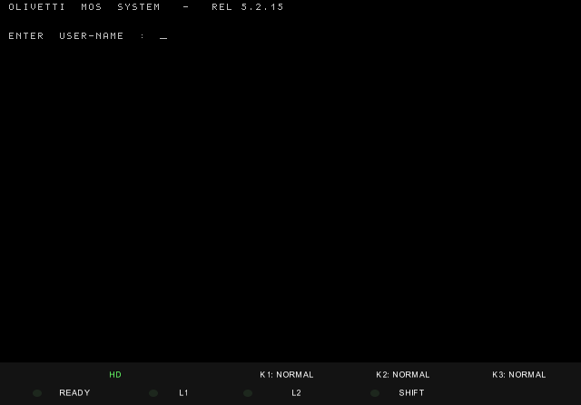

# Olivetti M30 / M40 (L1): reverse engineering and MAME emulation

The Olivetti **M40** is a Zilog **Z8001** multi-user computer of the Olivetti
**L1** line (1982); the M30 is its smaller sibling. This project
reverse-engineers the machine from its boot ROM, its field diagnostics and
its operating systems, and emulates it in **MAME**. The emulated M40 now
runs its original software: the DCOS diagnostics, ESE, MDOS, BCOS II from
floppy and from the hard disk, and MOS from the hard disk.

## What runs

| Software | Result | Where it is recorded |
|---|---|---|
| ROM REL 6.0 self-test and IPL | Passes; IPLs from floppy, and from the hard disk with the patched hd65 ROM | [doc/HARDWARE.md](doc/HARDWARE.md) §10; `scripts/test-m40-ram-config.sh` runs the ROM memory test for every RAM size |
| DCOS 8.4 field diagnostics | UC3003 and MEM813 with zero errors; UCV305 except an M44-only sub-test; RAMVID `ERR 00000`; 6030T6 FDU tests 1, 2, 3, 5; 4305T6 tests 1–10, 12–13; KEYTE1 runs, scancodes verified; CRTAN5 runs, its video-type check still fails. On the GO363: HDC5F5 formats the disk, S24W25 writes and reads back Standard 24, HDC505 fails test 2 (below) | Results table in [doc/DIAGNOSTICS.md](doc/DIAGNOSTICS.md); GO363 in [doc/GO363_DCOS_RECOVERY.md](doc/GO363_DCOS_RECOVERY.md) and the step table of [OSLEM_STATUS.md](re/os/oslem/OSLEM_STATUS.md) |
| ESE 3.1, MDOS 3.0, MDOS 3.1 utilities | Boot to `READY` | [re/os/OS_boot_media_survey.md](re/os/OS_boot_media_survey.md) |
| BCOS II 3.3 from floppy | All-resident system to its mono-user banner; the K02733 configurator to the SYS generator; the generated LOAD/RUN pair to the password prompt | [OS_boot_media_survey.md](re/os/OS_boot_media_survey.md), [re/os/bcos/BCOS_BOOT.md](re/os/bcos/BCOS_BOOT.md); the full generation walk-through is [BCOS_GENERATION.md](https://github.com/tpaxia/mame_disks/blob/main/m40/BCOS_GENERATION.md) in `mame_disks` |
| BCOS II 3.3 on the hard disk | Installed with the Olivetti restore procedure (JX24, MX24, TOC£, DKC£ under OSLEM 7+, which needed two debugger patches); boots to `/SYS` | [re/os/oslem/OSLEM_STATUS.md](re/os/oslem/OSLEM_STATUS.md); checked by `scripts/test-m40-hd.sh` |
| MOS 5.2.15 on the hard disk | Installed from the ST506 starter and the seven DPC_ALLES floppies; login, root menu, MCL, shutdown | [screenshots/](screenshots/) (install and login); login checked by `scripts/test-m40-hd.sh`; [mame_disks MOS section](https://github.com/tpaxia/mame_disks/blob/main/m40/README.md#mos) |
| Gardini NLS3000 utilities | Boots to its utility menu; its keyboard handshake matches the 8049 firmware | [GO252_BIT4_ABLATION.md](re/hardware/go252/GO252_BIT4_ABLATION.md) (boot regression), [keyboard/M40_8049_KEYBOARD.md](keyboard/M40_8049_KEYBOARD.md) (handshake), `scripts/test-m40-kdc-bit4.sh gardini` |

Not working yet: the GO363 board test HDC505 fails test 2 on the current build (a regression since 20 September; see [doc/MAME_DRIVER.md](doc/MAME_DRIVER.md) §9); MDOSC 2.0, 3.1 and 3.2 load but stop with `ERROR 172/173`;
BCOS II 5.0 boots only partway; OSLEM 7+ needs two debugger patches to
accept its own boot floppy (root cause open).

## Running it

Ready-to-run disk images, ROMs and instructions (including Windows
step-by-step guides) are published in
[mame_disks/m40](https://github.com/tpaxia/mame_disks/tree/main/m40).

The emulation is in the `m40_z8010_sup_test` branch of
[tpaxia/mame](https://github.com/tpaxia/mame/tree/m40_z8010_sup_test), not
yet in mainline MAME:

| Source | Models |
|---|---|
| `src/mame/olivetti/m40.cpp` | The machine (`m40`, and an `m44` variant) |
| `src/devices/bus/olivetti_l1/uc.cpp` | UC042 central unit: Z8001, Z8010 MMU, 8253, EF68B50 ACIA, MB15652 bus arbiter, console and IPL switch |
| `src/devices/bus/olivetti_l1/go252.cpp`, `keyboard.cpp` | GO252 video/keyboard board (MC6845, GI 9428DS character generator) and the ANK keyboard (a high-level model checked against its 8049 firmware) |
| `src/devices/bus/olivetti_l1/go280.cpp` | GO280 floppy board (uPD765, AM9517 DMA, 8253) |
| `src/devices/bus/olivetti_l1/go363.cpp` | GO363 hard-disk board around the uPD7261 (`-slot5 go363`) |
| `src/devices/bus/olivetti_l1/l1.cpp`, `ram.cpp` | The L1 backplane and RAM boards |

Booting from the hard disk needs `m40rom-6.0-hd65.bin`, a patched REL 6.0
ROM: REL 6.0, the latest M40 ROM available, cannot IPL the GO363. The patch
adds a GO363 sector-read routine (the register sequence of the OSLEM 7+
hard-disk driver) and the M44 ROM's service-table entries that the
hard-disk loader calls. It never existed as a real ROM; it is built from the
disassembly by [tools/mkrom_hd65.py](tools/mkrom_hd65.py).

## Main findings

The hardware, as recovered from the ROM, the diagnostics and the manuals:

- **[doc/HARDWARE.md](doc/HARDWARE.md)**: the machine as built: boards and
  chips, the three Z8000 address spaces, MMU and memory maps, the UC
  register map, the backplane slot scan, RAM sizing and the reset sequence.
- **[doc/MAME_DRIVER.md](doc/MAME_DRIVER.md)**: how the emulation implements
  it, and why: MMU suppression, READY/NMI, interrupt priority, GO280 DMA,
  arbiter, video, known approximations.
- **[doc/KDC.md](doc/KDC.md)** and **[keyboard/](keyboard/README.md)**: the
  GO252 video/keyboard board, the keyboard protocol and the recovered 8049
  keyboard firmware; how a PC keyboard maps onto the ANK keyboard.
- **[doc/GO363_DCOS_RECOVERY.md](doc/GO363_DCOS_RECOVERY.md)**: the GO363
  register protocol, which no surviving document describes, recovered from
  the DCOS hard-disk diagnostics and checked against the Olivetti manual and
  the NEC uPD7261 datasheet.
- **[doc/DIAGNOSTICS.md](doc/DIAGNOSTICS.md)**: the DCOS 8.4 diagnostic
  disks, their boot flow and the ROM-to-bootloader handoff.
- **[tools/L1_DISK_FORMATS.md](tools/L1_DISK_FORMATS.md)**: the L1 floppy and
  hard-disk formats (labels, module headers, library directories,
  configuration records).

Behaviour that the original software depends on and that had to be found
(each with its evidence in [re/evidence/](re/evidence/)):

- **Bus-arbiter latency.** The MOS kernel enables the non-vectored
  interrupt for a single instruction (`EI NVI`, `DI NVI`) after an arbiter
  request, so the arbiter must raise NVI within a few clocks; the model's
  old 50 µs delay stopped the kernel with code 51. Fixing it exposed a race
  in the floppy DMA model. Provisional: there is no MB15652 timing data
  ([uc-arbiter-nvi-latency](re/evidence/uc-arbiter-nvi-latency-evidence.md)).
- **Z8001 PC segment bit 15.** Settled on a physical Z8001, where the part
  contradicts the Zilog manual ([z8001-pcseg-bit15](re/evidence/z8001-pcseg-bit15-evidence.md)).
- **Two MAME Z8000 core bugs**, `COMB @Rd` register decode (found by the
  RAMVID diagnostic) and block-I/O instruction flags; they affect every Z8000
  machine in MAME ([doc/HARDWARE.md §10](doc/HARDWARE.md)).
- **uPD7261 timing and command behaviour**: read-data completion, buffered
  seeks, Verify ID after Format, DMA requests at sector boundaries.
- **GO252 keyboard port reset** and the **dumped character generator**,
  which replaces the hand-drawn font
  ([chargen](re/evidence/go252-chargen-evidence.md)).
- **The REL 6.0 ROM has no GO363 boot path**: its hard-disk IPL handler is
  for the older GO230 board ([OSLEM_STATUS, Issue 2](re/os/oslem/OSLEM_STATUS.md)).

## Repository map

| Folder | Contents |
|---|---|
| [doc/](doc/) | The hardware reference, the MAME driver notes, GO252, GO363 and the diagnostics |
| [re/](re/) | The reverse engineering: `disassembly/` (round-trippable ROM and bootloader sources, diagnostic listings), `hardware/` (per board), `os/` (per operating system), `evidence/` (one note per emulator change, written before it), `mame/` (driver history and the trace harness), `checkpoints/` (saved states and disk images, local only) |
| [keyboard/](keyboard/README.md) | Everything about the ANK keyboards: firmware, scancodes, key maps, photos |
| [installation/](installation/README.md) | Pointers to the published run instructions in `mame_disks`, and the MAME UI controls |
| [reference/](reference/README.md) | ROM images, datasheets and digests of the manuals; the disk images and scanned manuals are kept locally |
| [scripts/](scripts/README.md) | Launchers and regression tests; the hard-disk harness and MOS install stages |
| [tools/](tools/README.md) | ROM disassembly and rebuild, the patched-ROM builder, floppy-image tools, the diagnostic-disk harness |
| [screenshots/](screenshots/) | ESE, MDOS, BCOS generation and hard-disk login, MOS installation and login |

## Method

The ROM is disassembled into sources that reassemble byte for byte, so
annotations can be added and re-verified at any time
([re/disassembly/m40-rom/](re/disassembly/m40-rom/README.md)). The ROM's
power-on tests define the minimum hardware; the DCOS diagnostics and the
operating systems then define the rest. Every change to the emulator is
backed by hardware documentation or, where none exists, by the original
Olivetti software, and is checked against a regression set of diagnostics
and systems before and after. The method, with the cases that taught it, is in
**[DEBUGGING_STRATEGY.md](DEBUGGING_STRATEGY.md)**; the rules for changing
MAME are in [AGENTS.md](AGENTS.md).

## Open work

- The HDC505 test 2 regression, the MDOSC `ERROR 172/173` stops, BCOS II
  5.0, and the root cause behind the OSLEM 7+ patches.
- Decompiling MOS ([strategy](re/os/mos/MOS_DECOMPILATION_STRATEGY.md)).
- Submitting the driver and the Z8000 fixes to mainline MAME.
- Other central-unit boards on the existing card cage: an M30 machine and the
  M44's UC048 ([design](re/hardware/uc/M40_bus_slot_configuration_design.md)).

## Related work

**[L1WSE](re/os/l1wse/L1WSE.md)**: reverse engineering of the Olivetti M24
"L1 Work-Station Emulator", the DOS program that turns an M24 into an L1
terminal. It is the source of the official L1 MOS PC-keyboard mapping that
the MAME keyboard follows ([keyboard/KEYMAP.md](keyboard/KEYMAP.md)).
